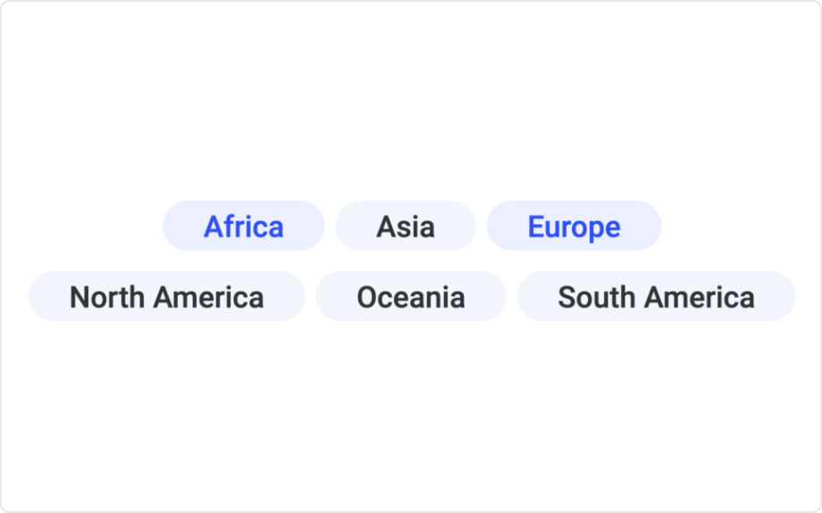

# Tag

Display a set of selectable tags that can be used to query a dataset based on keywords.

Each tag represents a unique comma separated value in a column. Selecting a tag will mark all rows where the corresponding value occurs. This marking can then be used to limit the data displayed in other visualizations.

## Installation and use

[Download latest version](https://github.com/spotfiresoftware/spotfire-mod-tag/releases)

The [User Guide](https://github.com/spotfiresoftware/spotfire-mod-tag/doc/user_guide.md) contains step-by-step instruction on how to install and use this Mod in Spotfire®.

## Building the project

In a terminal window:
- `npm install`
- `npm run build-watch`

In a new terminal window:
- `npm run server`

# More information about Spotfire® mods

- [Spotfire® Visualization Mods on the Spotfire® Community Exchange](https://community.spotfire.com/files/category/7-visualization-mods/): A safe and trusted place to discover ready-to-use Mods
- [Spotfire® Mods Developer Documentation](https://spotfiresoftware.github.io/spotfire-mods/docs/): Introduction and tutorials for Mods Developers
- [Mods by Spotfire®](https://github.com/spotfiresoftware/spotfire-mods/releases/latest): A public repository for example projects
