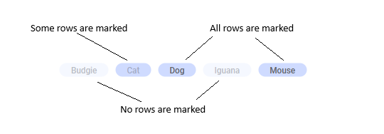
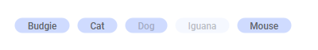

This mod for Spotfire® can be used to display a set of selectable tags that can be used to query a dataset based on keywords.

Each tag represents a unique comma separated value in a column. Selecting a tag will mark all rows where the corresponding value occurs. This marking can then be used to limit the data displayed in other visualizations.

# Try this mod in Spotfire® Analyst

## How to open the mod

1. Open Spotfire® Analyst, and create an analysis by loading some data.
1. Drag the mod file into the analysis.
1. The visualization mod is added to the analysis.
1. To learn about the capabilities and limitations of this visualization mod, keep reading.

For general information on how to use and share visualization mods, read the Spotfire documentation.

# Data requirements

**Every mod handles missing, corrupted and/or inconsistent data in different ways. It is advised to always review how the data is visualized.**

This visualization can be used to display tags in any data set with at least one categorical column.

# Setup

Let's say we have data about the people and their pets:

| Name   | Pet             |
| ------ | --------------- |
| Frank  | Dog             |
| Joe    | Dog, Cat        |
| Oliver | Cat,Dog         |
| Anna   | Dog, Cat        |
| Brie   | Dog, Cat, Mouse |
| Paula  | Cat, Mouse      |
| Eric   | Cat             |
| Jean   | Cat             |
| Bob    | Iguana          |

A basic tag visualization can be configured to show one tag per Pet with the following settings:
* Tags = Pet

The resulting tag list will look like this:

# Configuration

The visualization can be configured by setting the tag axis.

# Usage

## Marking
Clicking on a tag will mark all rows with that tag in all other visualizations that uses the same marking. You can mark several tags by Ctrl-clicking on them. Clicking outside the tags will unmark all rows.

Because each row can have multiple tags, the marking display will vary depending if all corresponding rows are marked, or only some of them.

Clicking a specific tag may result in other tags displaying as fully or partially marked depending on the underlying data. 

For example, starting with no marking, and the user clicks the "Cat" tag: 

* All rows of "Cat" are marked
* All rows of "Mouse" are marked because all "Mouse" rows are also "Cat" rows
* Some rows of "Dog" are marked that are also "Cat" rows, but not the remaining "Dog" rows
* No rows of "Iguana" are marked because no rows are also "Cat"

# Help and support

**This mod is not supported by Spotfire® Support.**

In the event of issues, to request help, or suggest enhancements, please post a topic in the Spotfire® forum on [Spotfire® Community](https://community.spotfire.com/forums/forum/18-spotfire/) and tag with **Mods**.

# More information about Spotfire® mods

- [Spotfire® Visualization Mods on the Spotfire® Community Exchange](https://community.spotfire.com/files/category/7-visualization-mods/): A safe and trusted place to discover ready-to-use Mods
- [Spotfire® Mods Developer Documentation](https://spotfiresoftware.github.io/spotfire-mods/docs/): Introduction and tutorials for Mods Developers
- [Mods by Spotfire®](https://github.com/spotfiresoftware/spotfire-mods/releases/latest): A public repository for example projects

Copyright (c) 2023-2025 Cloud Software Group, Inc. All Rights Reserved